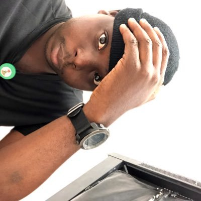

# 😌 Whoami

<figure><figcaption>
Muhammad Almustafa Garba 
</figcaption></figure>

I am a Husband and a Father to be, An Immigration Officer [@NIS](https://portal.immigration.gov.ng/pages/welcome), Student, Security n00b. Interested in Ethical Hacking and Penetration Testing, Cyber Security Research, Digital Forensics, RED Teaming, & Threat Hunting, UI/UX Design, Web and App development, I love doing Tech Support jobs, so that I can ease your day 2 day use of tech devices, I cofounded @dTr\_inc and @dTr\_Edu to help share the knowledge I am gathering kindly check it out. I love freelancing especially when it comes to Visual assisting and writing I can say it's a gift from God!

lastly, I'm a billionaire in the making in sha Allah Imma get one

> _<mark style="color:red;">**"RIJF Brother Al-ameen I miss you Bruh".**</mark>_&#x20;
